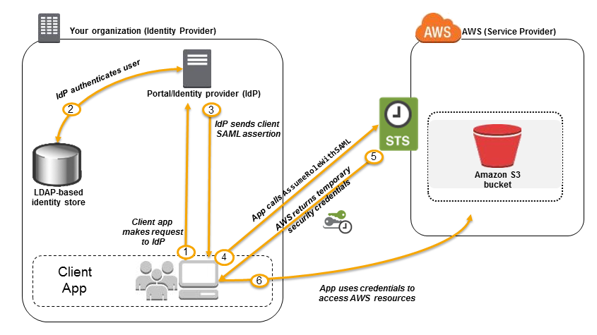
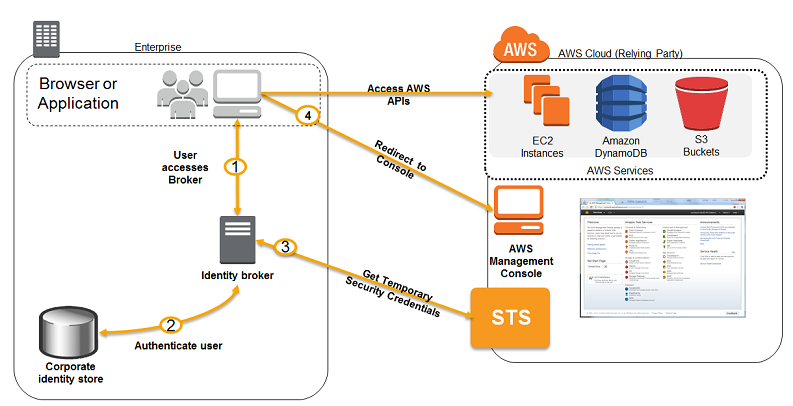

# Identity federation

- Federation lets users outside of AWS to assume temporary role (using STS) for accessing AWS resources without having to create a user in AWS.
- Federation assumes a form of 3rd party authentication e.g. LDAP, Microsoft Active Directory (=~ SAML), SSO, Open ID, Amazon Cognito
  - Single Sign On
  - Open ID
  - [Amazon Cognito](#amazon-cognito)

## AWS STS - Security Token Service

- Allows to grant limited and temporary access (permissions) to AWS resources
- Token is valid for between 15 minutes to one hour (must be refreshed)
- Used mostly for:
  - Generates tokens when assuming roles.
  - ***Cross Account Access*** that allows users from one AWS account access resources in another
    - ***Flow***
      1. Define an IAM role for another account to access
      2. Define which accounts can access this IAM role
      3. Use AWS STS (Security Token Service) to retrieve credentials and impersonate the IAM role you have access to (`AssumeRole` API)
  - ***Federation (Active Directory)***
    - Provides a non-AWS user with temporary AWS access by linking users Active Directory credentials
    - Uses SAML (Security Assertion markup language)
    - Allows Single Sign On (SSO) which enables users to log in to AWS console without assigning IAM credentials
  - ***Federation with third party providers ([Amazon Cognito](#amazon-cognito) & [Web Identity Federation](#web-identity-federation))***
    - [Amazon Cognito](#amazon-cognito): Used mainly in web and mobile applications
    - [Web Identity Federation](#web-identity-federation): Makes use of Facebook/Google/Amazon etc. to federate them

## Federation

- If users already have identities outside AWS, e.g. third party identity provider/your org.
  - You can federate their identities and use IAM roles to grant access.
- STS is common service to create credentials after identity validation
  - Identity validation can be done through SAML, Cognito or Custom Identity Broker application.
- Third party groups (like on-premises AD groups) map directly to **IAM Roles**, not IAM Groups.
  - IAM Groups are only used with native IAM Users created directly in AWS.

### SAML based federation

- To integrate Active Directory / ADFS with AWS (or any SAML 2.0)
- An **IdP** authenticates on on-premises store and then exchanges **SAML assertion** that has roles with STS to get a redirect URL with token.
- 

### Custom Identity Broker Application

- 💡 Use only if identity provider is not compatible with SAML 2.0
- You have to program ***Identity Broker*** that must determine the appropriate IAM policy.
- 

## Amazon Cognito

- Customer identity and access management (CIAM) service
- Fully managed with auto-scaling
- Identity store with adaptive authentication
- Managed identity broker for web identity federation
- **User pools**
  - Handles registration, authentication, account recovery.
  - Synchronizes user data for your users, username etc.
    - Uses Push Synchronization with SNS to push updates to sync data across multiple devices.
  - Includes JWT tokens from third party authentication providers.
- **Identity Pools**
  - User directory for clients.
  - Allows users to obtain temporary AWS credentials to access AWS resources.
  - Flow
    - User logs into federated identity provider & gets *third party authentication token*.
    - Send *third party authentication* token to Cognito
      - Cognito returns Cognito ID with temporary AWS credentials
  - E.g. Provide (temporary) access to write to S3 bucket using Facebook Login
  - 💡 Good for authenticating B2B & B2C users for web + mobile applications.

## Web Identity Federation

- Let users sign in via a well-known external identity provider (IdP) such as Amazon, Facebook, Google.
- An alternative to Cognito
- ❗ AWS recommends Web Identity Federation only for advanced scenarios.
- 💡 Mostly try to use Cognito, because it does most of the behind-the-scenes work with public identity provider services for you.

## AWS Directory Service

- Allows accessing resources both on premises and in AWS using the on premises credentials.
- **AWS managed Active Directory**
- 💡 Use cases
  - Can use it as an actual Microsoft Active Directory
  - Easily migrate directory-aware, on-premises workloads
  - Easily extend existing domains
  - 💡 Choose to integrate with on-prem ID if you don't want to setup federation / SAML infrastructure for SSO
- Integrations
  - SSO with corporate credentials to e.g. WorkSpaces, WorkDocs, or WorkMail.
  - AD-aware EC2 instances, [RDS](./06-02-01-data-databases-rds.md) SQL etc.
- **AWS Directory Service AD Connector**
  - Directory gateway to redirect directory requests to on-premises AD without caching any information in the cloud.
  - Eliminates the need for directory synchronization and the cost and complexity of hosting a federation infrastructure.
  - Enforce on-prem policies in cloud.
  - Use existing MFA infrastructure for MFA.
- **Simple Active Directory**
  - Standalone managed directory.
  - Subset of features from Microsoft AD based Directory Service.
  - Easier to manage for Linux environments

## AWS IAM Identity Center

- Previously known as *AWS Single Sign On*, *AWS Single Sign-On* or *AWS SSO*
- Centrally Managed Single Sign On across multiple AWS Accounts and Business Applications (Office 365, SalesForce, Box)
- One login gets you access to management console securely
- Integrated with Microsoft Active Directory.
  - 📝 Two-way trust is needed for querying the users and groups [1]
- Only helpful for Web Browser, SAML 2.0 enabled applications.
  - E.g. IdP (Identity Provider) initiated single sign on
- **Cognito vs AWS IAM Identity Center**
  - [Amazon Cognito](#amazon-cognito)
    - Customer-targeted IAM and user directory solution.
    - For customers/developers building B2C or B2B apps for their customers
  - AWS IAM Identity Center
    - Focused on SSO for employees accessing AWS and business apps

[1]: https://docs.aws.amazon.com/directoryservice/latest/admin-guide/ms_ad_setup_trust.html "Creating a trust relationship between your AWS Managed Microsoft AD and self-managed AD - AWS Directory Service | docs.aws.amazon.com"
