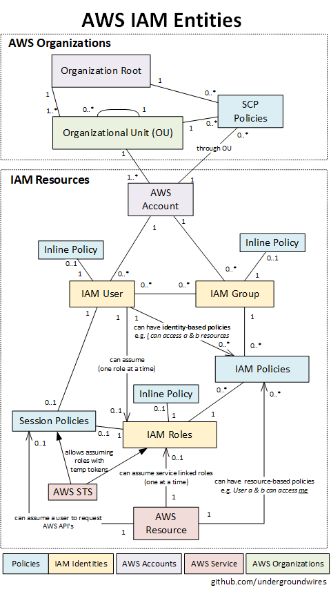

# IAM & Organization

## Account

- Registered with an e-mail address.
  - ❗ Not required for non-root accounts in AWS Organizations
  - *Owner* usually means the e-mail owner of the registered account.
- **Root Account**
  - User with e-mail address that created the account.
  - 💡 Create new IAM user with administrator privileges and lock away root account credentials. NEVER USE ROOT ACCOUNT FOR EVERY DAY AWS ACTIVITY. It allows unlimited access on your resources, hence, it is safe to proceed with IAM user. Also enable MFA on root account.

## IAM

- Centralized control of your AWS account.
  - Each API call to AWS is authorized using IAM.
- Shared Access to your AWS account
- Global. Does not apply to regions.
  - So you will use the same IAM configuration no matter if you use one of all regions.
- Identity Federation
  - Federating Users of Mobile/Web app using **Cognito**
    - Using Amazon Cognito will create identities (with the help of Mobile SDK) for users and sync across devices.
  - Federating Users with **OpenID Connect (OIDC)** or public identity service provider
    - Using third-party services like Facebook, Google or any identity providers (IdP) compatible with OIDC can federate users.
      - 💡 Amazon recommends against it, use Cognito or Web Identity Federation only for advanced scenarios.
  - Federating users with **SAML 2.0**
    - If companies managing users with identity store like Microsoft Active Directory and Active Directory Federation Service can federate users with single-sign on (SSO) to aws management console. Company can create trust between organization as an identity provider (IdP) and AWS as the service provider if it is compatible with SAML 2.0
  - Federating users by creating a **custom identity brokers**
    - If identity store is not compatible with SAML 2.0 then custom identity broker application can be built.
- Multifactor Authentication
  - 💡 If your MFA device is lost/damaged/notworking:
    - You can sign in using alternative methods of authentication.
      - E.g. sign in by verifying your identity using the email and phone that are registered with your account.
- Provide temporary access for users/devices and services where necessary
- Supports password policies:
  - Enforce strong password
  - Password rotation policy, e.g. expire after 90 days.
- Credential report: See which users are using what permissions.
- Integrates with many different AWS services
- Supports PCI DSS Compliance
- **IAM Certificate store**: Legacy way to upload certificates, use Certification Manager instead.
- **IAM Query API** to make direct calls to the IAM web service.

### IAM Entities

- 
- **Principal** is an entity in AWS that can perform actions and access resources.
  - **IAM Users**
    - **Programmatic Access: ID + secret key**
      - Mostly for machines.
      - 💡 Best practice for services is to assume roles
      - Assigned an Access Key ID and Secret Access Key when first created.
      - Secrets are only shown once after created, then needs to be regenerated to reveal/download again.
      - ❗ IDs are permanent you need to manually rotate (make active/disable, delete or create new)
    - **Console Access: Password**
      - 💡 Ensure no one share same users by creating different users per person.
      - By default, newly created IAM users has no permissions.
  - **IAM Roles**
    - 💡 Use cases:
      - Create roles and can then assign them to AWS resources
      - Give cross-account access to users.
      - Instead of being uniquely associated with one person, a role is intended to be assumable by anyone who needs it.
        - 💡 However for unique access of one you can delegate a role through:
          - In account add *trust policy* that specifies which trusted account members are allowed to assume the role.
          - The *trust policy* specifies which trusted account members (*principal*s) are allowed to assume the role.
    - Credentials are rotated automatically -> Only temporary access.
      - Uses STS with expirations to generate secret id + secret key.
    - You can only assume one role a time
- **IAM Groups**
  - A collection of users under one set of permissions (policies)
  - 💡 Use groups to assign permissions instead of individual users, because users in group inherit the permissions from groups.
  - A group is not an identity and cannot be identified as a principal in an IAM policy,
- **IAM Policies**
  - JSON document that defines one (or more) permissions
  - **Resource-based**: To supported AWS resources, who can access them.
  - **Identity-based**: Assigned to roles, users, groups, who they can access.
  - Overlap => Deny overrides allow.
  - To define resources ARN's are used (Amazon Resource Names) to uniquely identify AWS resources
  - 💡 Principle of Least Privilege: Always adhere to it when creating IAM user, restrict access with only resources/actions to do the job.

#### IAM Authentication to Services

- Most of AWS services authenticates a user / role.
- User / role (IAM) credentials must be sent in header
  - It's called Sig v4 **AWS Signature Version 4 Signing Process**
  - You sign all requests with signed using an access key (derivation of access key ID + secret access key) in header
- All requests to AWS API's are signed automatically by SDK/CLI.

## AWS Organizations
  
- Consolidate multiple AWS accounts into an organization that you create and centrally manage
  - Enforce Service Control Policy (SCP) centrally on root or OU's.
    - Also SCP has precedence over individual's permission.
    - Best suitable for restricting access across multiple accounts in an organization.
- Grouping all of your AWS accounts into **Organizational Units** (OUs) as part of a hierarchy
  - Hierarchical based control over groups of IAM users and roles, within multiple Accounts.
- Allows **Consolidated billing**: Multiple standalone accounts are combined and may reduce your overall bill
  - They can still be tracked individually and the cost data can be downloaded in a separate file.
- Allows you to create accounts programmatically.
