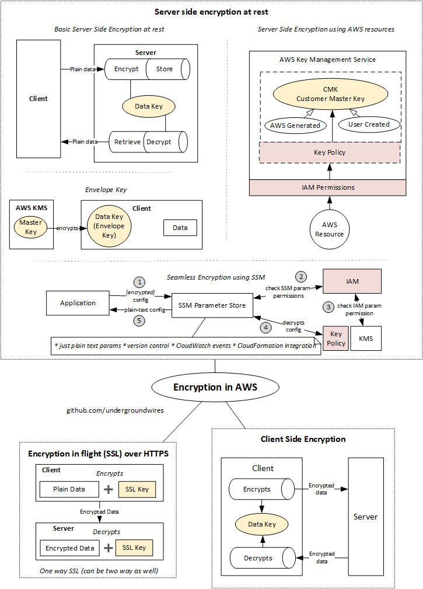

# Encryption in AWS

- 

## Encryption key

- Two solutions currently exist for managing encryption keys:
  - **Hardware security modules (HSM)**
    - HSM = Hardware security module
    - Designed and certified to be tamper-evident and intrusion-resistant, provide the highest level of physical security, no hardware sharing.
    - **AWS CloudHSM**
      - Cloud-based hardware security module (HSM)
      - Single-tenant access to HSM, hardware maybe shared.
      - Enables you to easily generate and use your own encryption keys on the AWS Cloud.
      - Primarily intended to support customer-managed applications that are specifically designed to use HSMs
      - CloudHSM cluster contains at least two HSMs => min 1.000$ per month.
      - Can have automatic back-ups
      - Lose the keys => no way to recover
  - **Key management services (KMS)**
    - Also known as a cryptographic key management service (CKMS)
    - Enables clients to manage encryption keys without concerns about HSM appliance selection or provisioning
    - Usually come with more scalability, availability, native integration with other services such as databases, Bring Your Own Key (BYOK) that allows you use external HSM for master keys.
    - **AWS KMS** is AWS offering for a key service system.

### AWS KMS - Key Management Service

- An integrated & managed approach for generating, distributing and managing cryptographic keys for devices and applications
  - Managing a key includes maintaining their *key policies*, *IAM policies*, *enabling/disabling them*, *rotating*. *adding tags*. *creating aliases*, *scheduling for deletion*.
    - **Rotation policies** e.g. key must be changed ever year
- **Monitoring**: Audit key usage using CloudTrail
- Integrates with e.g. EBS (volumes), S3 (SSE), Redshift, RDS and SSM.
  - IAM for authorization: 💡 Can add external accounts that can use the key.
- 💡 Managed KMS key per service is created for AWS services e.g. one for CodeCommit, one for RDS, one for S3, one for Lambda...
- Has API's in CLI /SDK
- **Customer Master Keys (CMKs)**

  | Type | Can view | Can manage | Account-specific | Price |
  | ---- | ---- | ------ | ------------------- | -- |
  | Customer managed CMK | ✔️ | ✔️ | ✔️ |  Monthly fee key + usage |
  | AWS managed CMK | ✔️ | ❌ | ️✔️ | No monthly fee, just usage |
  | AWS owned CMK | ❌ | ❌ | ❌ | Free |
  - ❗ The value in KMS is that the *CMK (Customer Master Key)* used to encrypt data can never be retrieved by the user.
  - The CMK can be rotated for extra security.
- Encrypted secrets can be stored in the code / environment variables
  - E.g. **encryption helpers** in lambda environment variables.
  - No one can decrypt without having access through IAM
- KMS can only help in encrypting up to 4KB of data per call
- ❗ KMS can only encrypt up to 4KB of data per call
  - 📝 If data > 4 KB, use envelope encryption
  - Envelope encryption = Encrypt your key (data key) using master key.
- To give access to KMS to someone
  - Make sure the Key Policy allows the user
  - Make sure the IAM Policy allows the API calls
- ***Flow***
  - ***Encrypt API***: *KMS* checks IAM permissions & performs encryption & sends encrypted secret
  - ***Decrypt API***: *KMS* check IAM permissions & performs decryption & sends decrypted secrets (in plain-text)

### AWS Systems Manager - Systems Manager Parameter Store

- Secure storage for configuration and secrets
- (*Optional*) Seamless Encryption using KMS
  - Requires KMS policy to be activated
- Serverless, scalable, durable, easy SDK, free
- Version tracking of configurations / secrets
- Configuration management using path & IAM
  - 💡 Best practice to give IAM role for reading only the needed parameter
  - For plain text configurations it's enough to give SSM read permission
    - For decrypted parameters, you also need to give IAM permission to KMS.
- Notification with CloudWatch Events
- Integration with CloudFormation
- ***Flow***:
  - *Application* sends encrypted configuration to *SSM Parameter Store*
  - *SSM Parameter Store* checks IAM permissions
  - *SSM Parameter Store* decrypts configuration using AWS KMS
  - *Application* receives plain-text configuration from *SSM Parameter Store*.
- Supports hierarchy, e.g. `my-department/my-app/dev/db-url`.
- Configurations are retrieved using `GetParameters` or `GetParametersByPath` API.
- Two ways of accessing from portal:
  1. *EC2 Systems Manager - Parameter Store*
  2. from *AWS Systems Manager* -> Parameter Store.
- Two tier of parameters:

  | Feature | Standard | Advanced |
  | ------- | -------- | -------- |
  | Max parameter | 10.000 | No limit |
  | Max value size | 4 KB | 8 KB |
  | Parameter policies | None | Available |
  | Pricing | Free | Charges apply |
  - Parameter must have:
    - Name (e.g. `/my-app/dev/db-url`)
    - Type: `String`, `StringList` (comma separated), `SecureString`

## Encryption types

- **Encryption in flight (SSL)**
  - Data is encrypted before sending and decrypted after receiving
  - SSL certificates help with encryption (HTTPS = SSL enabled)
  - Encryption in flight ensures no MITM (man in the middle attack) can happen
    - I.e. No one inspecting the traffic can see data
  - ***Flow***
    - You send data SSL encrypted with key and over HTTPS
    - Server (HTTPS website) decrypts data with SSL key.
- **Server side encryption at rest**
  - Encryption/decryption is handled by server-side
    - Data is encrypted after being received by the server
    - Data is decrypted before being sent
  - Used by many AWS services
  - It's stored in a encrypted form thanks to a key (usually a ***data key***)
  - The encryption / decryption keys must be managed somewhere and the server must have access to it.
    - Usually stored in KMS (Key Management Service)
  - ***Flow***
    - Object is being sent using HTTP(s)
      - Server (e.g. EBS AWS service) encrypts object with data key & saves it
    - Object is requested using HTTP(s)
      - Server decrypts object with data key & sends it
  - ❗ Requires migration (through Snapshot Backup) to enable/disable in EBS Volumes, RDS databases, ElastiCache, EFS
  - In S3, it's in-place e.g. you encrypt & decrypt with parameters.
- **Client side encryption**
  - Data is encrypted by the client and never decrypted by the server
  - Data will be decrypted by a receiving client
  - The server should never not be able to decrypt the data
  - 📝Could leverage ***Envelope Encryption***
    - You encrypt encryption key with **Envelope Key** in KMS.
    - You manage encryption key, AWS manages Envelope Key.
  - ***Flow***:
    - Client encrypts object with *Client side data key* & sends
    - Object is stored in encrypted form in AWS
    - Client retrieves encrypted object and decrypts with *Client side data key*
