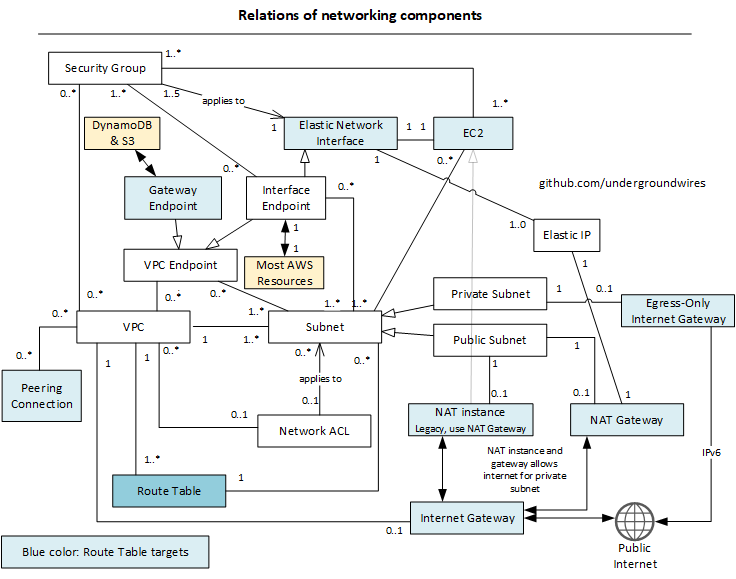
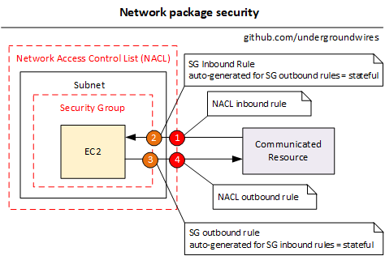
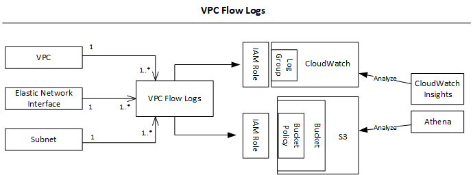

# VPC

- VPC = Virtual Private Cloud
- ❗ You can have max 5 VPCs in a region - soft limit
- ❗ Your VPC CIDR should not overlap with your other networks (e.g. corporate)
- VPC can be deployed in to shared hardware (default) or dedicated hardware (costly).
- A VPC is multi AZ but deployed into a single region.
- **IP addressing in VPC**
  - Only private IP ranges as it's private.
  - Can add new ranges as IPv6 or IPv4 CIDR after creating the VPC.
  - ❗ Max CIDR per VPC is 5.
  - ❗ For each CIDR:
    - Min size is /28 = 16 IP addresses
    - Max size is /16 = 65536 IP addresses
- **Default VPC** in
  - All new accounts have a default VPC in each region.
  - It comes with
    - Subnet per AZ
    - Internet gateway
    - Network ACL: allows all inbound and outbound traffic
    - Main route table that routes VPC CIDR range to local and `0.0.0.0/0` to Internet gateway.
    - Security group denying inbound from internet, allowing outbound to internet.
  - Instances get public & private IPv4 + hostnames
    - In custom VPC = private IP + hostname, and public depending on settings
- **VPC Components**
  - 
- **DNS Resolution in VPC**
  - `enableDnsSupport` (DNS Resolution setting)
    - Helps decide if DNS resolution is supported for the VPC
    - If true (default), queries the AWS DNS server at `169.254.169.253`
  - `enableDnsHostname` (DNS Hostname setting)
    - If True, assign public hostname to EC2 instance if it has a public IP
      - Private DNS is always assigned regardless true or false
    - False by default for newly created VPC, True by default for Default VPC
    - Won't do anything unless `enableDnsSupport=true`
  - 📝 Private DNS + Route 53: enable DNS Resolution + DNS hostnames (VPC) DNS domains and their subdomains keeping the resources masked from the Internet.
- ❗ **Multicast** is not supported.
  - Multicasting: one or more sources can transmit network packets to subscribers
  - 💡 You can enable virtual overlay network
    - It's IP level multicast across network fabric unicast IP routing supported by VPC.

## Package security

### Network Access Control Lists (NACLs)

- Like firewall which control traffic from and to subnets.
- Deployed into VPC
- NACLs are ***stateless*** filtering rules
  - Stateless because if an ingress traffic is allowed, the response is not automatically allowed unless explicitly allowed in the rule for the subnet.
- Applied at the subnet level and applies to every resource deployed to the subnet
  - A subnet can have only one NACL
  - Same NACL can be applied to multiple subnet
- ***NACL Rules***
  - Rules are numbered and evaluated in order
  - Starting with the lowest numbered rule
    - E.g. `#100 ALLOW <IP>` override `#200 DENY <IP>`
    - Last rule is an asterisk (*) and denies a request in case of no rule match
    - 💡 AWS recommends adding rules by increment of 100 for leaving some places for future rules
- Default NACL allows everything outbound and everything in bound
  - ❗ Newly created NACL will deny everything
- **Ephemeral ports**
  - An ephemeral port is a short-lived transport protocol port for Internet Protocol (IP) communications.
  - Ephemeral ports are allocated automatically from a predefined range by the IP stack software.
  - Allows returning traffic to clients
  - Range varies depending on the client's operating system
    - E.g. Linux 32768 - 61000, Elastic Load Balancing 1024 - 65535, Windows Server 49152 - 65535
    - Different OS and different applications will pick different ports.
  - To cover the different types of client that might initiate traffic to public-facing instances in your VPC, you can open ephemeral ports 1024 - 65535 (NAT Gateway ports) to outbound connections.
    - You should deny malicious ports

### Security Groups

- ***stateful*** e.g. if inbound rule passes, outbound rule passes as well
- Applied at the EC2 instance level
  - More specific: Elastic Network Interface (ENI) level

### Security Groups vs Network Access Control Lists

- Differences

  | Attribute | Security Group | NACL |
  | --------- | -------------- | ---- |
  | Execution | Instance (ENI layer) | Subnet boundary |
  | State | Stateful (one direction rules) | Stateless (must configure both inbound & outbound) |
  | Life scope | VPC (any AZ or Subnet) | Subnet Scoped (must be attached explicitly to subnets) |
  | Applies to | Instance only | All instances in the associated subnets |
  | Rules | Allow rules only | Allow and Deny rules both |
  | Rule order | Evaluate all rules as group | In number order, if hit a match, does not check other rules |
- Reasons to use both:
  - SG have soft limit of 50 rules.
  - More security layers = better, protection against misconfigurations
  - Segregation of responsibilities, Network Admins for NACLs, SGs for Server Admins.

## VPC Peering

- Connect two VPC, privately using AWS network
- Make them behave as if they were in the same network
- ❗ Unsupported VPC Peering Configurations
  - Must not have overlapping CIDR
  - VPC Peering connection is not transitive
    - Must be established for each VPC that need to communicate with one another
    - E.g. if a <-> b and b <-> c it does not mean a <-> c
  - Edge to Edge Routing Through a Gateway or Private Connection
    - E.g. corporate network through Direct Connect, Internet through internet gateway, internet in subnet through NAT, VPC endpoint to an AWS and Ipv6 ClassicLink connection
- You can do ***cross-account*** & ***cross-region*** VPC peering
- You must update route tables in each VPC's subnets to ensure instances can communicate,
- The accepter VPC must "accept" the peering connection,
- Flow in console:
  1. Go to VPC -> Peering connections -> Create ***peering connection***
  2. Define requester & accepter VPC.
  3. Go to accepter VPC -> right click -> accept request
  4. In each VPC, route CIDR range of other VPC to the ***Peering Connection***

## VPC Endpoints

- Allow you to connect to AWS Services using AWS network instead of the public www network.
- They scale horizontally and are redundant
- They remove the need of IGW, NAT etc... to access AWS Services
- PrivateLink = VPC Endpoints
- Two types of endpoints:
  - **Interface**
    - Provisions an ENI (Elastic Network Interface with private IP address) as an entry point
    - Must attach security group
    - Most AWS services
      - Services hosted by other AWS customers and partners in their own VPCs
      - AWS marketplace services
    - You can see the resource but can't manage
    - You have to define which subnets the endpoint will live.
    - Ensure that the attributes `Enable DNS hostnames` and `Enable DNS Support` in VPC are set to true.
  - **Gateway**
    - S3 and DynamoDB only
    - In route table it provisions a target for internal S3/DynamoDB to the VPC endpoint automatically.
    - Ensure resources accessing S3 (e.g. EC2) has IAM role to the resource
- In case of issues:
  - Check DNS Setting Resolution in your VPC
  - Check route tables
  - Ensure you're trying to reach endpoint within same region

## Flow Logs

- 
- Capture information about IP traffic going into your interfaces:
  - VPC Flow Logs
  - Subnet Flow Logs
  - Elastic Network Interface Flow Logs
- Can capture from managed services such as ELB, RDS, ElastiCache, Redshift, WorkSpace
- Helps to monitor & trouble shoot connectivity issues & security attacks
  - Can log ACCEPT traffic, REJECT traffic or both.
- Data is sent to either S3 or CloudWatch Logs
  - 📝 You can query VPC flow logs using ***Athena*** on S3 or ***CloudWatch Logs Insights***
- **Flow Log Syntax**
  - `<version>`, `<account-id>`, `<interface-id>`, `<srcaddr>`, `<dstaddr>`, `<srcport>`, `<dstport>`, `<protocol>`, `<packets>`, `<bytes>`, `<start>`, `<end>`, `<action>`, `<log-status>`
    - `<srcaddr>` and `<dstaddr>` help identify problematic IP
    - `<srcport>` and `<dstport>` help identify problematic ports
    - `<action>`: success or failure (accept / reject) of the request due to  Security Group / NACL
    - `<log-status>`: `OK` -> logging normally, `NODATA`: No network traffic to or from during capture window, `SKIPDATA`: Skipped during capture windows because of e.g. capacity constraint or an internal error.
- Can be used for analytics on usage patterns, or malicious behavior
- ❗ You cannot allow it in peered VPCs unless the peer is in your account.
- ❗ Does not monitor: instances when they contact Amazon DNS server, Windows license activation, to and from `169.254.169.254` instance metadata, DHCP, to reserved Id address for the default VPC router.

## Connect & manage private instances

- **Bastion Host** (Jump Boxes)
  - Designed to withstand security attacks and usually hosts only a proxy server
  - Used to administer EC2 (SSH/RDP)
    - Does not replace NAT gateway/instance as they are not used for SSH/RDP but to provide internet traffic to private subnets.
  - The bastion is in the public subnet /(DMZ) which is then connected to all other private subnets
  - 💡 Small EC2 instances is enough as it does not require much processing power.
  - Bastion Host security group must be tightened
    - 📝💡 Make sure the bastion host only has port 22 traffic from the IP you need, not from the security groups of your instances

- **SSM Session Manager**
  - Systems Manager allows you to remotely execute commands on managed hosts without using a bastion host
    - Way to go in future and will replace bastion hosts
    - You don’t have to manage SSH keys.
  - Free & serverless AWS managed service
  - Requires an IAM policy that allows users or roles to execute commands remotely.
  - Agents require an IAM role and policy that allow them to invoke the Systems Manager service.
    - The Systems Manager agent is an open-source executable that runs on supported versions of Linux and Windows
  - Systems Manager immutably logs every executed command
