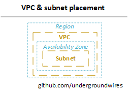

# Subnets

- 📝 A subnet must only belong to one AZ and cannot span AZs.
  - 
- ❗ Max allowed CIDR range is `/16`, min is `/28`
- ❗ AWS reserves 5 IP addresses (first 4 and last 1 IP address) in each Subnet
  - These 5 IPs are not available for use and cannot be assigned to an instance
  - E.g. if CIDR block `10.0.0.0/24`, reserved IP are:
    - `10.0.0.0`: Network address
    - `10.0.0.1`: Reserved by AWS
    - `10.0.0.2`: Reserved by AWS for mapping to Amazon-provided DNS
    - `10.0.0.3`: Reserved by AWS for future use
    - `10.0.0.255`: Network broadcast address.
      - AWS does not support broadcast in a VPC but address is reserved.
  - 📝 E.g. if need 29 IP addresses for EC2 instance, you can't choose a Subnet size of /27 (32 IP)
  - Each instance in any subnet is assigned a static private address, i.e. does not change with stopping/starting instances.
- **Route table**
  - Deployed into VPC
  - When you create a VPC, it automatically has a ***main route table***.
  - Each subnet must have a route-table attached to it.
    - They're associated to main route table if they don't have any.
  - Any time when a route destination is down/terminated, the status of the route becomes ***blackhole***.
  - Default route in route table is destined for the IP range of the VPC that allows all subnets within a VPC to communicate with each other.
  - Route rules
    - Defined destinations (where packet wants to go) and targets (where it will go).
    - Priority: most specific range gets selected if overlapping i.e. **longest prefix match**.
  - **Route propagation**: It is the task of your service provider to advertise to the backbone sites that they are the point of connection (and thus the path inward) for your site. This is known as route propagation.
- 🤗 Penetration testing & vulnerability scanning to own VPC is allowed!

## Private Subnet

- Any subnet without the IGW is regarded as private subnet and have no internet connectivity without NAT gateway.
- Bigger in size as you put all your applications etc.
- Can deploy **Egress-Only Internet Gateway (EGW)**
  - Blocks incoming traffic while still allowing outbound traffic
  - ❗ IPv6 only use NAT for IPv4.
    - All IPv6 are public addresses; instances become publicly accessible.
  - ❗ Edit the route tables, after creating; outbound route to destination (`::/0`), target: gateway

## Public Subnet

- Usually much smaller in size and contains load balancers only.
- A subnet is public if it has an internet gateway (IGW) attached.
  - **Internet Gateway**
    - Allows VPC to connect with the internet
      - Route tables must be edited: Destination 0.0.0.0/0 to Internet Gateway
    - It scales horizontally and is HA and redundant
    - ❗📝 One VPC can only be attached to one IGW and vice versa
    - It's **NAT** for instances that have a public IPv4
      - NAT translates the IP addresses of computers in a local network to a single IP address.
    - ❗ Edit the route tables, after creating; outbound route to destination (`0.0.0/0` and `::/0`), target: gateway
- You can enable ***auto-assign public IPv4 address***
  - A new EC2 instance by default get an IP address
  - By default instances do not get public IP if it's not enabled.

### NAT

- The actual role of a NAT device is address and port address translation (PAT
- In AWS, you can use a NAT device to enable instances in a private subnet to connect to the internet (for e.g. for software updates) or other AWS services, but prevent the internet from initiating connections with the instances.
- NAT instances and Gateways must be deployed in public subnet.
- **NAT Instances**
  - Outdated & not recommended use ***NAT Gateway*** instead
  - EC2 instance that allows instances in the private subnets to connect to the internet
    - Amazon Linux AMI pre-configured are available
  - Configurations:
    - 📝 Must disable EC2: Source / Destination Check
      - Keep it enabled for all instances except NAT
      - NAT instance must be able to send and receive traffic when the source or destination is not itself.
    - Must have Elastic IP attached to it
    - Allow HTTP+HTTPS from VPC.
  - Route table must be configured to route traffic from private subnets to NAT instance
  - Not highly available / resilient setup out of the box
    - Would need to create ASG in multi AZ + resilient user-data script
  - Internet traffic bandwidth depends on EC2 instance performance
  - Must manage security groups & rules:
    - Inbound
      - Allow HTTP / HTTPS traffic coming from Private Subnets
      - Allow SSH from your home network (access is provided through Internet Gateway)
    - Outbound
      - Allow HTTP /HTTPS traffic to the internet
- **NAT Gateway**
  - AWS managed NAT, higher bandwidth, better availability, no administration
    - Deployed into public subnet
  - NAT is created in a specific AZ, uses an EIP (Elastic IP)
    - 💡 For high availability, it's good to deploy different NAT gateways in different AZ.
  - Cannot be used by an instance in that subnet (only from other subnets)
  - Requires an IGW (internet gateway): Private Subnet => NAT => GW
  - **Scalability**
    - 5 GBPS of bandwidth
    - ❗ Automatic scaling up to 45 GBPS
  - No security group to manage
  - Pay by the hour for usage and bandwidth
  - **Security**: Use NACL to control traffic to and from the subnet in which your NAT gateway resides.
- **NAT Gateway vs NAT Instance** [doc](https://docs.aws.amazon.com/vpc/latest/userguide/vpc-nat-comparison.html)

  | Attribute | NAT Gateway | NAT instance |
  | --------- | ----------- | ------------ |
  | High availability | highly available in each AZ with redundancy | Use a script to manage failover between instances |
  | Bandwidth | Can scale up to 45 Gbps | Depends on bandwidth of the instance type |
  | Maintenance | Managed by AWS | Managed by you |
  | Performance | Software optimized | Generic Linux AMI |
  | Security groups | Cannot be associated (use NACL in its subnet) | can be associated with |

## Gateway cheat sheet

| Type | Subnet accessibility | When |
| ---- | ---------- | ---- |
| Egress only | Private subnet | IPv6 internet in private subnet. |
| NAT Gateway | Private subnet | IPv4 internet in private subnet. |
| Internet Gateway | Public subnet | Once for VPC for internet access in VPC. |
