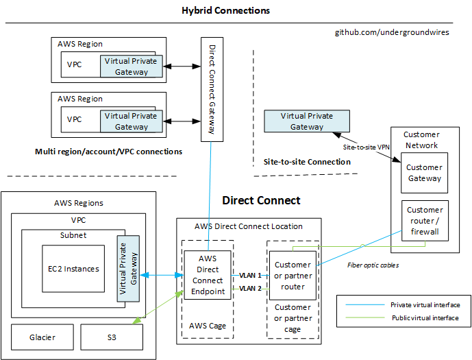

# Hybrid Connections

- 

## Site to site VPN

- Allows customer site (corporate network) to seamlessly communicate with AWS VPN as it's in the same network
- Links *Virtual Private Gateway* from AWS side to *Customer Gateway* from customer side.
- **Virtual Private Gateway (VPG)**
  - Deployed on VPC level (not subnet).
  - Allows AWS to provide connectivity from AWS to other networks via VPN or Direct Connect.
  - AWS requires Customer Gateway (CGW) on the customer side to connect to AWS VPC
  - VPN concentrator on the AWS side of the VPN connection
  - Created and attached to the VPC from which you want to create the Site-to-Site VPN connection
  - Possibility to customize the **ASN**
    - ASN = autonomous system number
    - A unique number that's available globally to identify an autonomous system and which enables that system to exchange exterior routing information with other neighboring autonomous systems.
    - Internet = network of networks
      - Routing is done through cooperation of autonomous systems (AS)
      - Each AS cooperate to route the traffic to destination
      - Each AS does routing within AS, then across AS and when it reaches destination, routing is done by the destination AS
    - Different ISPs communicate through Border Gateway Protocol (BGP)
      - Border Gateway Protocol (BGP) is a standardized exterior gateway protocol designed to exchange routing and reachability information among autonomous systems
- **Customer Gateway**
  - Software application or physical device on customer side of the VPN connection
  - 📝 IP Address:
    - Use static, internet-routable IP address for your customer gateway device
    - If behind a CGW behind NAT, use the public IP address of the NAT instead of the public IP of the gateway
- ❗📝 You need to allow Route propagation on VPC
  - **Route propagation** allows VPC to find your internal site in Site-to-Site connection.
  - Routes representing your Site-to-Site VPN connection automatically appear as propagated routes in your route table.
- ***Flow***
  1. Set-up customer gateway on-premises with your device/software
  2. Create customer gateway in AWS
  3. Set-up Virtual Private Gateway
     - You can choose amazon default ASN (dynamic: BGP ASN) or custom ASN (static)
     - Add private network in route table and enable route propagation.
  4. Create Site-to-Site VPN connection between gateways

## Direct Connect

- Provides a dedicated ***private*** connection from a remote network to your VPC.
  - Uses AWS Direct Connect links (fiber cables) from your Data Center to Direct Connect locations.
- You need to setup a ***Virtual Private Gateway*** on your VPC
- Access public resources (S3) and private (EC2) on same connection
  - Accesses all AZs within a region
- 💡 Use cases:
  - Increase bandwidth throughput
    - E.g. working with large data sets and want lower cost on bandwidth
  - More consistent network experience
    - E.g. you experience shutdown & data loss
    - E.g. you need to have applications using real-time data feeds
  - Hybrid environments (on-prem + cloud)
- Supports both IPv4 and IPv6
- If you want to setup a Direct Connect to one or more VPC in many different regions (same account), you must use a Direct Connect Gateway
- **Direct Connect Gateway**
  - Allows multi region, multi account and multi VPN connections
  - 📝Does not peer, it allows between VPC and customer network
- **VPN as back-up**
  - Use same VPG for both Direct Connect and VPN connection
  - IP configurations
    - For BGP in VPN => Advertise the same prefix for Direct Connect and the VPN.
    - Static VPN => Add the same static prefixes to the VPN connection
    - If same routes advertised: Direct connect path will always be preferred.
