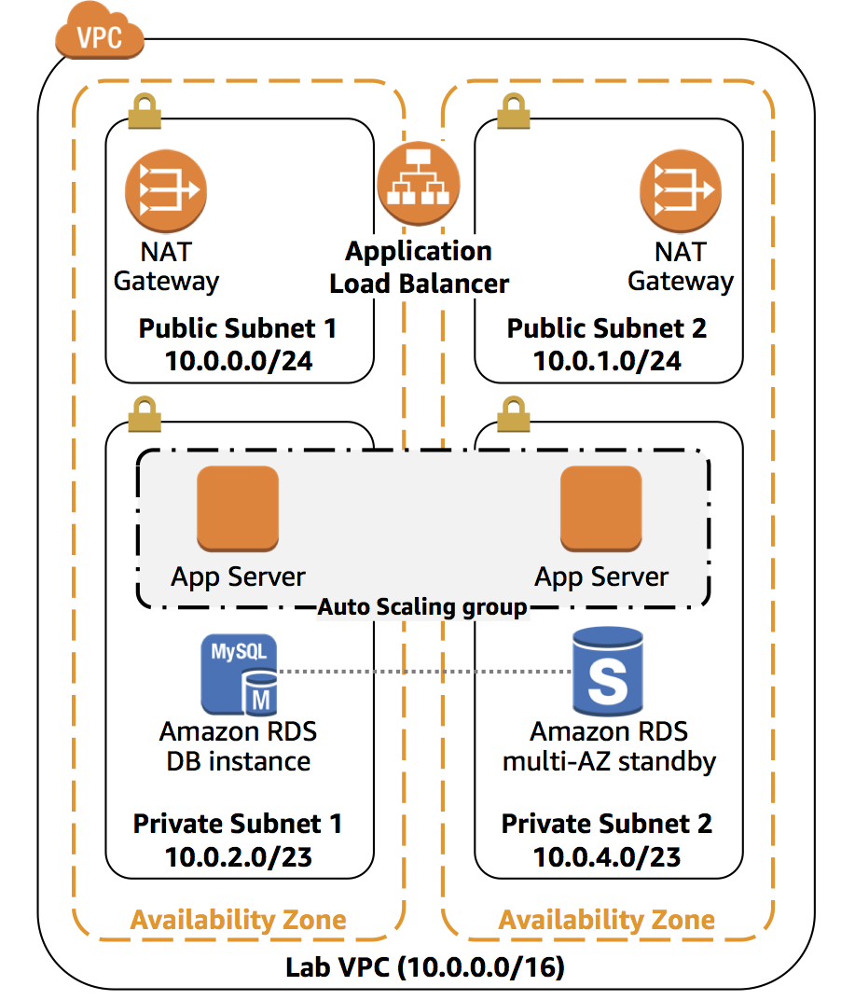
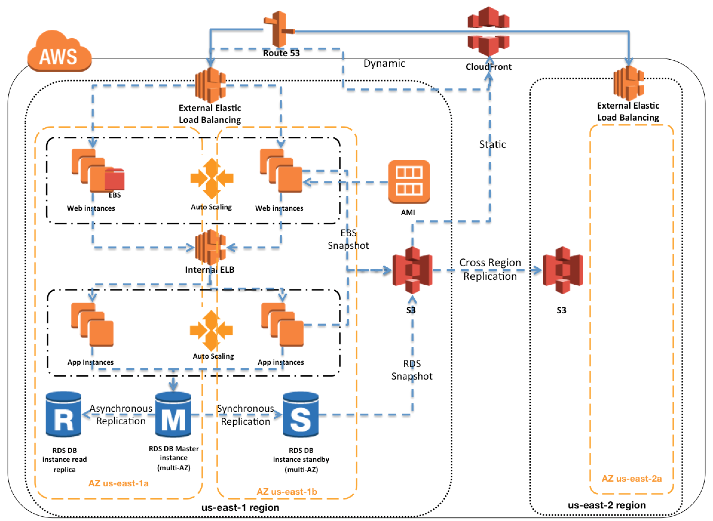
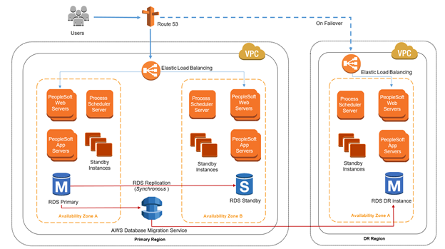

# High Availability and Scalability

## Scalability

- Application / system can handle greater loads by adapting
- Scalability is linked but different to high availability
- **Elasticity**
  - System can adapt to workload changes by provisioning and de-provisioning resources automatically to match current demand as closely as possible.
- Two kinds of scalability
  - **Vertical Scalability**: scale up & down
    - Increasing the size of the instance e.g. from `t2.micro` to `t2.large`
    - Common use case
      - Distributed systems, such as database
      - RDS, ElastiCache can scale vertically
    - Hardware limits how much you can scale
  - **Horizontal Scalability** (= elasticity): scale in & out
    - Increase number of instances / systems for application
    - Common for web applications / modern applications
    - Easy with e.g. Amazon EC2 through right-clicking
      - For EC2, you can use *Auto Scaling Group*s or *Load Balancer*s for horizontal scaling

## High Availability

- Goes hand in hand with horizontal scaling
- Running application in at least 2 data centers (= Availability Zones)
  - Goal is to survive a data center loss
- Can be:
  - Passive e.g. RDS Multi AZ
  - Active e.g. for horizontal scaling
- For EC2, you can use *Auto Scaling Group* with multi AZ enabled and *Load Balancer* with multi AZ enabled.
- 💡 Design for failure as it can happen
  - 🤗 Netflix has simian army (monkeys) to inject failure into their production systems.
    - E.g.
      - Chaos Monkey => Terminate random EC2 instances
      - Chaos Gorilla => Delete entire AZ
      - Latency Monkey => introduces latency.
      - and [more](https://medium.com/netflix-techblog/the-netflix-simian-army-16e57fbab116)...

### Common architectures

- **Single region HA architecture**
  - 
  - 3 tier application with 3 tiered security

    | Tier | Role | Example service | Security Group |
    | ---- | ---- | --------------- | -------------- |
    | 1 | Client | Application Load Balancer | Allow HTTP + HTTPs |
    | 2 | Application  | Application servers (EC2) | Allow HTTP from Client |
    | 3 | Database | Amazon RDS | Allow e.g. MySQL from application SG |
  - In a single VPC
    - At least 2 AZ and and in each AZ:
      - A public subnet and in each public subnet:
        - Deploy NAT gateway
        - Load balance public subnet in AZs through application load balancer
      - A private subnet and in each private subnet:
        - Deploy application server in same auto-scaling group
        - Create route table that routes internet (0.0.0.0/0) to the NAT gateway of a public subnet in same AZ
        - Configure auto-scaling group to put servers in public Load balancer
        - Deploy RDS instance in one, and RDS multi-AZ standby in other one
  - 📝 E.g. if you have minimum 6 instances running and can tolerate failure of 1 AZ failure:
    - Deploy 3 AZ with 3 instances in each AZ so you always have 6 instances running.

- **Multi region HA architecture**
  - E.g. using S3
    - 
  - E.g. using RDS
    - 
