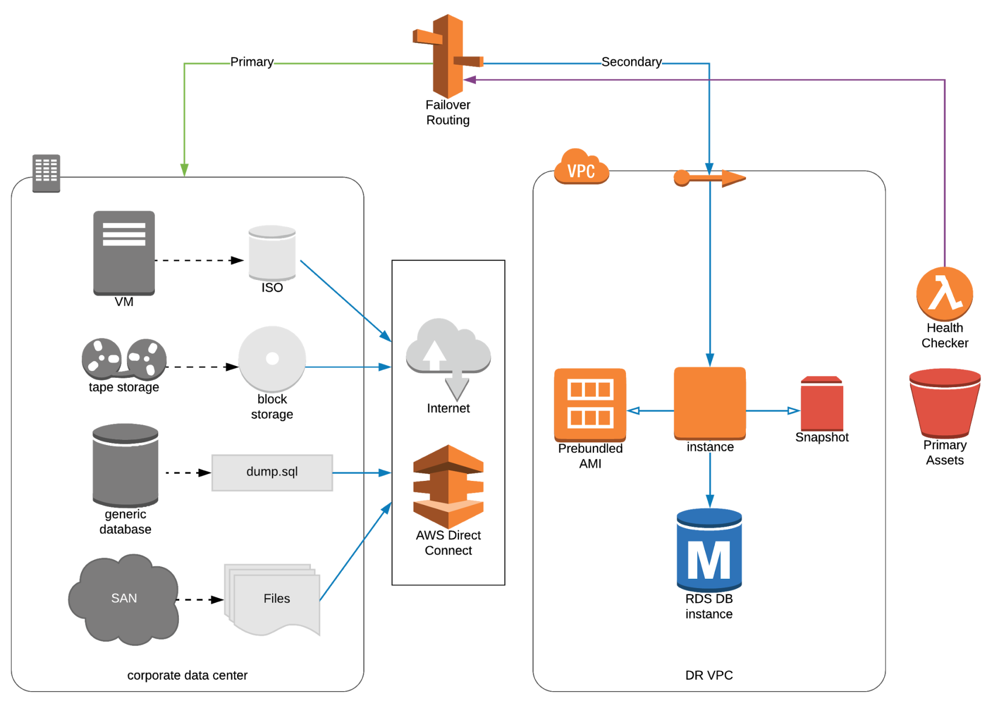
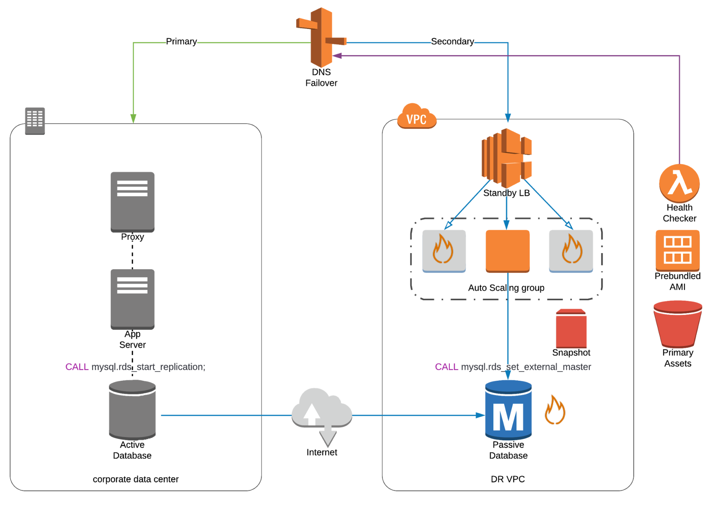
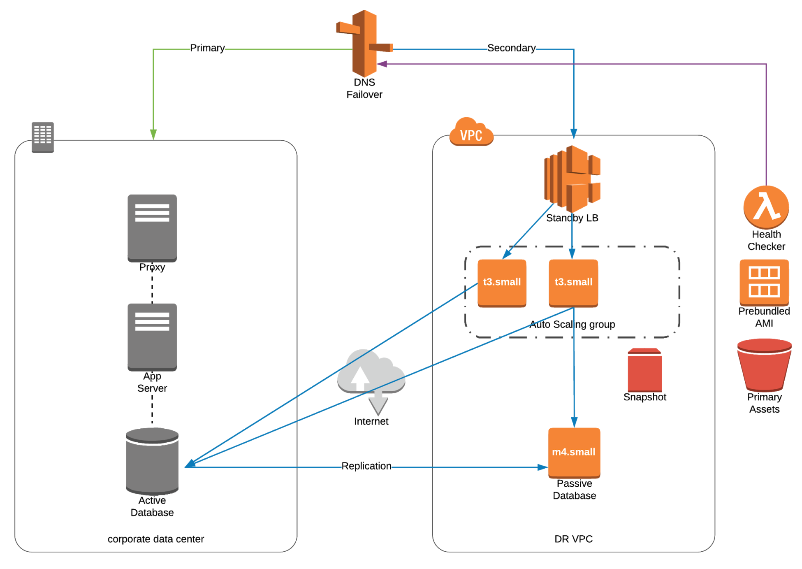
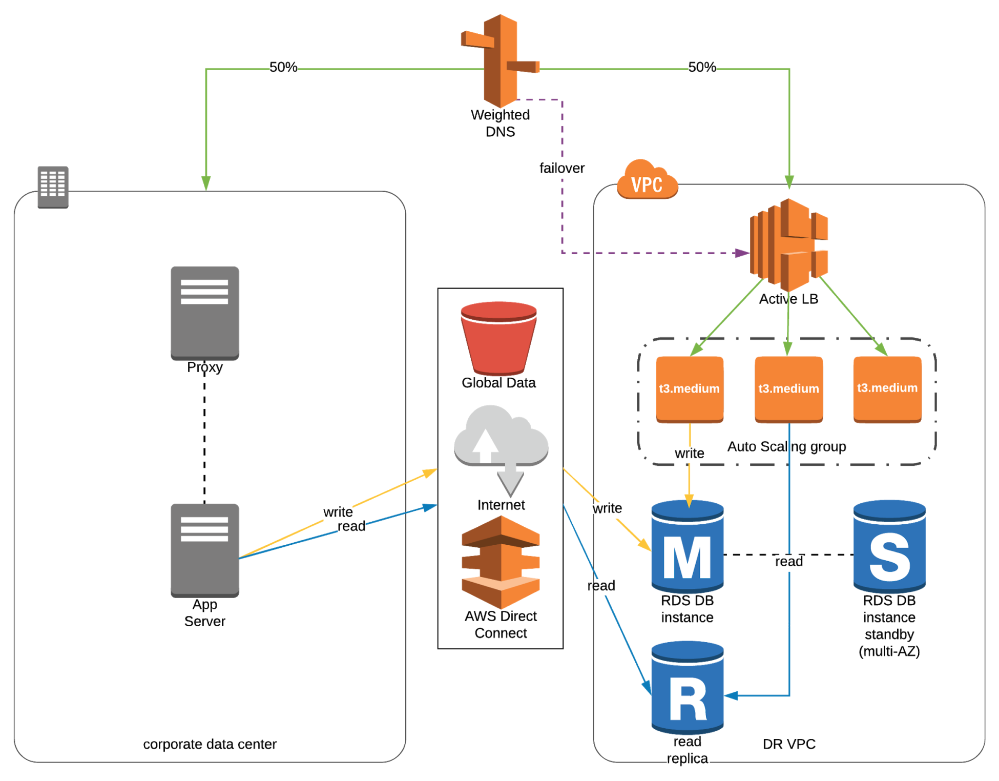

# Disaster Recovery in AWS

- Disaster Recovery (DR) is about preparing for and recovering from a disaster
  - Disaster: events that have negative impact on business continuity or finances
- Recovery types to cloud:
  1. ***On-premise => On-premise***: Traditional DR, very expensive
  2. ***On-premise => Cloud***: Hybrid recovery
  3. ***Cloud => Cloud***: e.g. AWS Cloud Region A => AWS Cloud Region B
- 📝Terminology
  - **RPO: Recovery Point Objective**
    - The amount of data loss you're willing to accept
    - Based on:
      - How back in time you can recover
      - How often you take back-up
  - **RTO: Recovery Time Objective**
    - Amount of downtime you're willing to accept
- **Disaster Recovery Strategies**
  - From business continuity to uninterrupted business:
    - *Backup and Restore* -> *Pilot Light* -> *Warm / Hot Standby* -> *Hot Site / Multi Site*
  - **Backup and Restore**
    - Cheapest option, slowest RTO.
    - Take frequent snapshots of your data:
      - from e.g. EBS Volumes, RDS databases, EC2 AMI's
      - to e.g. S3
    - AWS Storage Gateway enables from on-premises to cloud back-up seamlessly
    - 
  - **Pilot Light**
    - Critical core element(s) of the app is always running in the cloud
      - Faster than Backup and Restore as critical systems are already up.
    - Example of ***active/passive failover configuration***.
    - From networking, you have two options: Elastic IP addresses or Elastic Load Balancing (ELB)
      - DNS records to point to EC2 or point to LB using CNAME.
    - Changed data in DR site after failover must be reversed back to primary site after failback.
    - 
  - **Warm / Hot Standby**
    - Scaled-down full production environment always running in the cloud.
      - Upon disaster, we can scale to production load
    - Example of ***active/passive failover configuration***.
    - Changed data in DR site after failover must be reversed back to primary site after failback.
    - 
  - **Hot Site / Multi Site**
    - Full Production Scale is running AWS and on-premise
    - Example of ***active-active failover configuration***.
    - Changed data in DR site after failover must be reversed back to primary site after failback.
    - 💡 In Route 53: You configure active-active failover using any routing policy (or combination of routing policies) other than failover.
    - 
- 💡 **Disaster Recovery Tips**
  - ***Backup***
    - EBS Snapshots, RDS automated backups / Snapshots, etc...
    - Regular pushes to S3 / S3 IA / Glacier, Lifecycle Policy, Cross Region Replication
    - From On-premise: Snowball or Storage Gateway
  - ***High Availability***
    - Use Route 53 to migrate DNS over from Region to Region
    - RDS Multi-AZ, ElastiCache Multi-AZ, EFS, S3
    - Site to Site VPN As a recovery from Direct Connect
  - ***Replication***
    - RDS Replication (Cross Region), AWS Aurora + Global Databases
    - Database replication from on-premise to RDS
    - Storage Gateway
  - ***Automation***
    - CloudFormation / Elastic Beanstalk to re-create a whole new environment
    - Recover / Reboot EC2 instances with CloudWatch if alarms fail
    - AWS Lambda functions for customized automations
  - 🤗 **Chaos**
    - Netflix has a "simian-army" randomly terminating EC2.
      - Chaos monkeys terminates instances in production.
